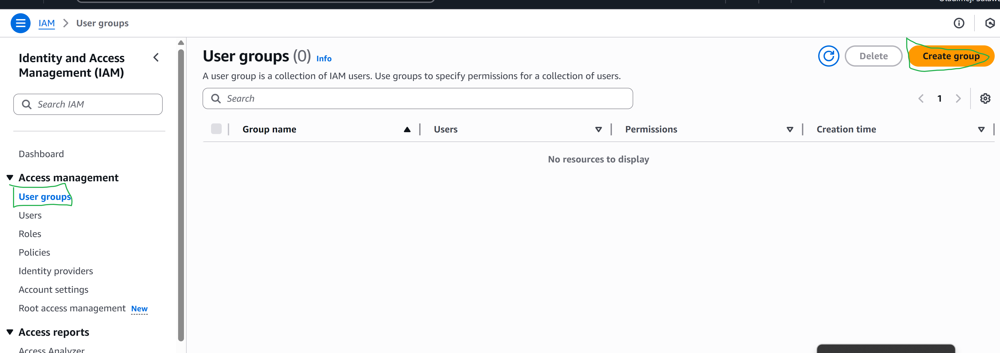
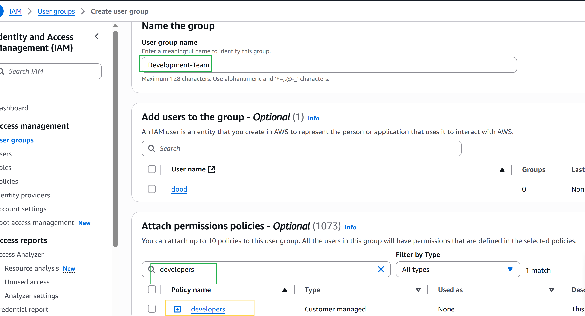
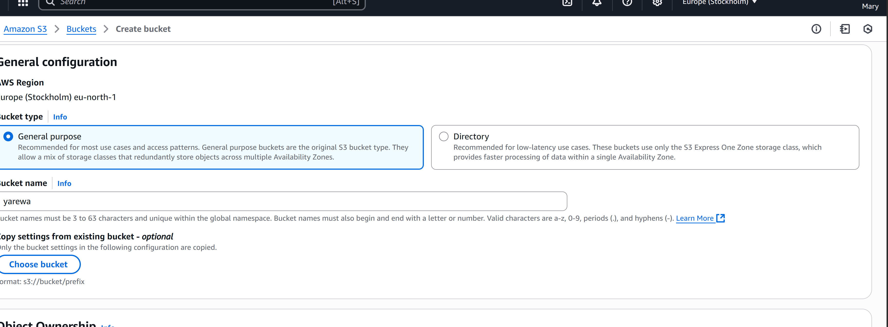

# AWS IAM Project Documentation

This README documents a hands-on AWS Identity and Access Management (IAM) project.  
The project demonstrates **secure access management** for a developer (**John**) and a data analyst (**Mary**) by setting up IAM users, custom policies, and Multi-Factor Authentication (MFA) — all following the **principle of least privilege**.

---

## Project Overview

In this project, you will:

1. Log in to the AWS root account.
  

3. Create custom IAM policies:
     - **EC2 access** for developers
   
    
    
    
    
    
    
    
  - **S3 access** for analysts
   -  
    
    
    
    
    
    
    
    

##Create custom user group: for Development-Team

##Create custom user group: for Data-Team

  
## Create IAM users:
   - John (**Developer**) 
   
     
    
     
    
    
    
     
 
 
 - Mary (**Analyst**)
 -   
     
    
   
   
   
   
   
##Assign policies to users.
   
   

8. Validate permissions for each user.
   ##User John
   
   
   
   
   
   
   
   
   
   
   
   
   

   ##For Mary
    
   
   
   
   
   
   
   
   
   
   
   
   
10. Enable MFA for both users.
  ##For John
   
      
   
   
    
      
   
  ##For Mary
    
   
  
   

---

### Principle of Least Privilege
- **Grant only what is needed.**  
- Reduces risk and improves security.

---

## Scenario Summary

| User   | Role         | Permissions      | MFA Enabled | Group         |
|--------|--------------|------------------|-------------|--------------|
| John   | Developer    | EC2 (custom)     | ✅          | Developers   |
| Mary   | Data Analyst | S3 (custom)      | ✅          | Analysts     |

Both users **only** have the access they need for their job functions.

---

1. Role and Purpose of IAM in AWS:
IAM (Identity and Access Management) in AWS is used to securely control access to AWS resources. It allows you to create users, groups, and policies for managing permissions. IAM helps organizations enforce security by ensuring only authorized users can access specific cloud resources—making cloud management both safe and efficient.

2. Difference Between IAM Users and Groups:

IAM Users: Individual identities (like a developer or analyst) with their own credentials and permissions.
Example: Create a user for John so he can log in and manage EC2 instances.
IAM Groups: Collections of users with shared permissions, making access management easier for teams.
Example: Place all developers in a “Developers” group and attach the EC2 policy—everyone in the group gets the same access.
3. Creating IAM Policies:
To create a custom IAM policy:

Identify the role (e.g., developer needs EC2 access).
Select the necessary permissions (actions on EC2, like “StartInstances”).
Write the policy (usually in JSON format).
Attach the policy to the appropriate user or group.
This ensures each user or group gets only the permissions they need.
4. Principle of Least Privilege:
The principle of least privilege means giving users only the minimum permissions required to perform their tasks. In AWS IAM, it’s vital for security—limiting user access reduces the risk of accidental changes or security breaches.

5. John and Mary Scenario:

John (Developer): Created as an IAM user, added to the “Developers” group, and given a custom EC2 policy—he can only access EC2, not S3 or other services.
Mary (Data Analyst): Created as an IAM user, added to the “Analysts” group, and given a custom S3 policy—she can access S3 but not EC2.
Both users have MFA enabled. These configurations match their job roles and follow least privilege—each has access only to what’s needed for their work.
---

## Need Help?

Open an [issue](https://github.com/Dowlib1/Zappy-e-Bank/issues) or contact the repo owner for questions.

---

**Happy Securing on AWS!** 🚀🔐
